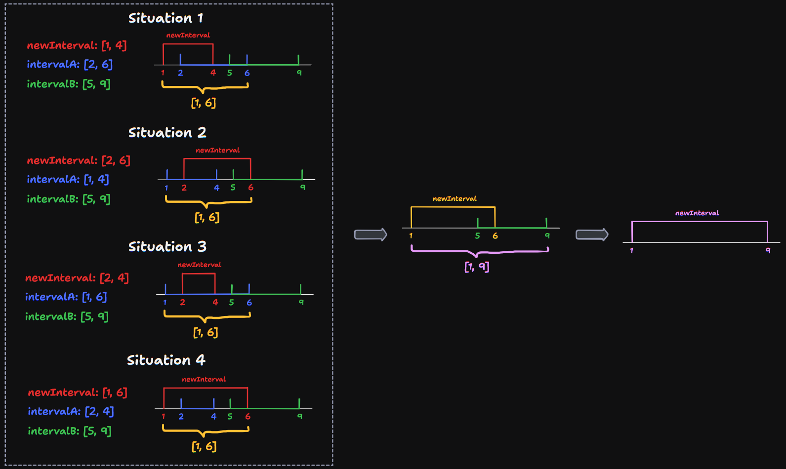

# 57 Insert Interval

Created: September 9, 2024 2:54 PM<br>
Difficulty: Medium<br>
Topics: Array<br>
Status: Done<br>

## 📖Description

[Insert Interval](https://leetcode.com/problems/insert-interval/description)

## 🤔Intuition

To understand the description of this problem, we can imagine that given interval `newInterval` is a greedy snake and each interval in the given `intervals` is food. If there is an intersection between “snake interval” and the “food interval”, means that this snake will eat this food. After eating, the length of this snake (“snake interval”) will increase to the length of the union of “snake interval” and the “food interval”. Until there are no intersections of the “snake interval” and the “food interval”, return the “snake interval” and the residual “food intervals”, and the return value will be the disjoint set.

## 📋Approach

### Growth Of The “Snake Interval”

There are four situations where the “snake interval” and the “food interval” intersect, and the growth process is shown in the following figure.



We can use one judgment condition to detect these four situations:

```tsx
intervals[i][0] <= newInterval[1]
```

### Step By Step Breakdown

- Start a `while` loop until there is a intersection of `intervals[i]` and `newInterval` .
    - Append the `intervals[i]` to the `result` .
- Start a `while` loop until `intervals[i]` and `newInterval` no longer intersect.
    - Update `newInterval` to the union of `intervals[i]` and the `newInterval` .
- By now the the operations related to `newInterval` have ended, append the `newInterval` to the `result` .
- Start a `while` loop until `i` reaches the end of `intervals` .
    - Append the residual intervals to the `result` .
- Return the `result` .

## 📊Complexity

- **Time complexity:** $O(N)$
- **Space complexity:** $O(N)$

## 🧑🏻‍💻Code

```tsx
function insert(intervals: number[][], newInterval: number[]): number[][] {
    const intervalsLen: number = intervals.length;
    const result: number[][] = [];
    let i: number = 0;

    while (i < intervalsLen && intervals[i][1] < newInterval[0]) {
        result.push(intervals[i]);

        ++i;
    }
    while (i < intervalsLen && intervals[i][0] <= newInterval[1]) {
        newInterval = [
            Math.min(newInterval[0], intervals[i][0]),
            Math.max(newInterval[1], intervals[i][1])
        ];

        ++i;
    }

    result.push(newInterval);

    while (i < intervalsLen) {
        result.push(intervals[i]);

        ++i;
    }

    return result;
}
```

## 🔖Reference

None.
