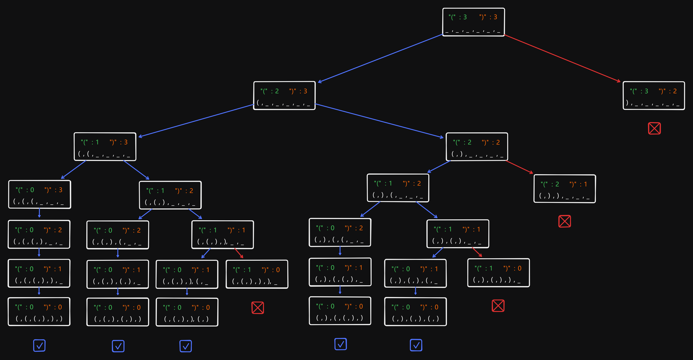

# 22 Generate Parentheses

Created: July 4, 2024 9:47 AM<br>
Difficulty: Medium<br>
Topics: Backtracking, Dynamic Programming, String<br>
Status: Done<br>

## 📖Description

[Generate Parentheses](https://leetcode.com/problems/generate-parentheses/description)

## 🤔Intuition

This problem is about to generating all combinations of well-formed parentheses. First, we need to know which combination type is valid. Consider this case `n = 2` , the combinations `"(())"` and `"()()"` are regarded as valid but `")()("` is not. In other words, it means each open brace `"("` must uniquely match a closed brace `")"` .

We can quickly have an answer to this problem by using the backtracking approach.

## 📋Approach

A simple but inefficient method is to first find out all the distinct combinations, and then check each combination for the well-formed parentheses property.

We can combine [47 **Permutations II**](https://www.notion.so/47-Permutations-II-f3c96d29a71247188dbf82d20240deb3?pvs=21) and [131 Palindrome Partitioning](https://www.notion.so/131-Palindrome-Partitioning-f7612b3ba4454f619c50796c891288d8?pvs=21) to implement this approach. All we need to do is replacing the number elements with parentheses.

### Space-State Tree



### Initialization

We need to initialize the given `n` to the string of parentheses according to the rule of the putting the same element together, which is a prerequisite for deduplication method, similar to the step of sort in [47 **Permutations II**](https://www.notion.so/47-Permutations-II-f3c96d29a71247188dbf82d20240deb3?pvs=21).

```tsx
let parenthesis: string = '';
for (let i = 0; i < 2 * n; ++i) {
    parenthesis += i < n ? '(' : ')';
}
```

### Well-formed Parentheses Check

**Implement a helper function** `isWellFormed(str)` **:** This function use a stack to check whether the given string of parentheses is well-formed.

```tsx
const isWellFormed = (str: string): boolean => {
    const stack: string[] = [];

    for (const char of str) {
        if (char === '(') {
            stack.push(char);
        } else if (char === ')') {
            if (stack.length === 0) {
                return false;
            }
            stack.pop();
        }
    }

    return stack.length === 0;
};
```

### Recursive Backtracking

**Implement a helper function** `backtrack(path)`**:**

- If the length of `path` is equal to `2 * n` and `isWellFormed(path)` is `true` , append the current `path` to the `result` .
- Iterate over all elements each time from zero to `2 * n` .
    - If the candidate combination start with `")"` , it will be impossible to be a well-formed parentheses, skip it.
    - If the `parenthesis[i - 1] === parenthesis[i] && !visited[i - 1])` , means that the previous branch has already used `parentesis[i - 1]` , in other words, the same tree layer has used `parentesis[i - 1]` . Therefore, we skip indices for avoiding duplicates.
    - If the current element is already in `visited` , skip it.
- Mark the `parentesis[i]` as taken and append it to the `path`.
- Recursively call `backtrack` with updated `path` .

## 📊Complexity

- **Time complexity:** $O(2^{2n}*n)$
- **Space complexity:** $O(n)$

## 🧑🏻‍💻Code

```tsx
function generateParenthesis1(n: number): string[] {
    const result: string[] = [];
    const visited: boolean[] = new Array<boolean>(n).fill(false);

    let parenthesis: string = '';
    for (let i = 0; i < 2 * n; ++i) {
        parenthesis += i < n ? '(' : ')';
    }

    const isWellFormed = (str: string): boolean => {
        const stack: string[] = [];

        for (const char of str) {
            if (char === '(') {
                stack.push(char);
            } else if (char === ')') {
                if (stack.length === 0) {
                    return false;
                }
                stack.pop();
            }
        }

        return stack.length === 0;
    };

    const backtrack = (path: string): void => {
        if (path.length === 2 * n && isWellFormed(path)) {
            result.push(path);

            return;
        }

        for (let i = 0; i < 2 * n; ++i) {
            if (
                (i > 0 &&
                    parenthesis[i - 1] === parenthesis[i] &&
                    !visited[i - 1]) ||
                visited[i]
            ) {
                continue;
            }

            path += parenthesis[i];
            visited[i] = true;
            backtrack(path);
            visited[i] = false;
            path = path.slice(0, -1);
        }
    };

    backtrack('');

    return result;
}
```

## 📋Optimized Approach

**The following points is the deficiencies of above-mentioned approach:**

- The array `visited` is unnecessary.
- Find out all the possible combinations is expensive.

An optimized approach is to build the combination one character at a time, ensuring at each step that the combination remains well-formed.

We can draw a conclusion by observing the Space-State Tree that a combination is well-formed if at any point, the number of `")"` doesn’t exceed the number of `"("` .

### Recursive Backtracking

**Implement a helper function** `backtrack(path)`**:**

- If the length of `path` is equal to `2 * n` , it means we have used `n` pair of parentheses, so we append the combination to `result` .
- The first choice can only be open brace `"("` .
- If the number of open brace `"("` used is less than `n` , we can continue add `"("` to the `path` .
- If the number of close brace `")"` used is less than the number of open brace `"("` , we will add `")"` to the `path` .

## 📊Complexity

- **Time complexity:** $O(2^{2n}/\sqrt{n})$
- **Space complexity:** $O(n)$

## 🧑🏻‍💻Code

```tsx
function generateParenthesis(n: number): string[] {
    const result: string[] = [];

    const backtrack = (
        numOpen: number,
        numClose: number,
        path: string
    ): void => {
        if (path.length === 2 * n) {
            result.push(path);

            return;
        }

        if (numOpen < n) {
            backtrack(numOpen + 1, numClose, path + '(');
        }

        if (numClose < numOpen) {
            backtrack(numOpen, numClose + 1, path + ')');
        }
    };

    backtrack(0, 0, '');

    return result;
}
```

## 🔖Reference

1. [https://leetcode.com/problems/generate-parentheses/solutions/5388832/easy-approach-recursion-stack-backtracking-lifo/](https://leetcode.com/problems/generate-parentheses/solutions/5388832/easy-approach-recursion-stack-backtracking-lifo/)
2. [https://leetcode.com/problems/generate-parentheses/solutions/3290261/i-bet-you-will-understand-intutive-solution-beginner-friendly-c/](https://leetcode.com/problems/generate-parentheses/solutions/3290261/i-bet-you-will-understand-intutive-solution-beginner-friendly-c/)
