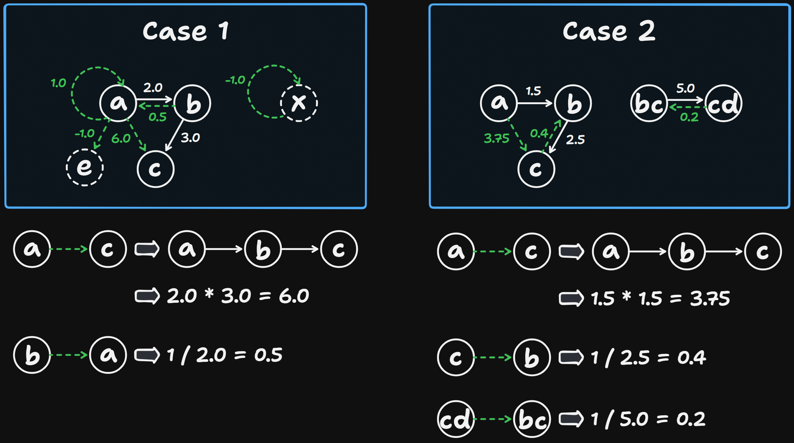

# 399 Evaluate Division

Created: October 9, 2024 1:57 PM<br>
Difficulty: Medium<br>
Topics: Depth-First Search, Graph<br>
Status: Done<br>

## 📖Description

[Evaluate Division](https://leetcode.com/problems/evaluate-division/description/)

## 🤔Intuition

At the first glimpse this problem looks mathematical, but we can recognize it as a graph problem after drawing an illustration. So we need to first construct a graph based on the calculation rules, then iterate over the `queries` and handle each query based on the constructed graph.

## 📋Approach

### Calculation Rules

Based on the given equation $A_i/B_i$ = `values[i]` , we can infer following equations:

1. Giving $A/B$ = $V_1$,  $B/C$ = $V_2$, then $A / C$ = $V_1 * V_2$.
2. Giving $A/B$ = $V$, then $B / A$ = $1 / V$.

### Construct the Graph

We will use a map which stores the mapping relationship between $A_i$, $B_i$ and their equation results $V_i$ to construct the graph (including their inverse operations).

```tsx
const variableMap: Map<string, Map<string, number>> = new Map();

equations.forEach(([left, right], index) => {
    if (!variableMap.has(left)) {
        variableMap.set(left, new Map());
    }
    if (!variableMap.has(right)) {
        variableMap.set(right, new Map());
    }

    variableMap.get(left)!.set(right, values[index]);
    variableMap.get(right)!.set(left, 1 / values[index]); // inverse operations
});
```

### Illustration



### Implement the Helper Function `dfs(from, to, visited)`

Due to the calculation rule one, we need to find out the path of from `from` to `to` , and calculate the cumulative product on-the-fly. So the Depth-First Search technology is very suitable.

- If `from` is equal to `to` , based on the problem description, return `1` .
- Define the base case, if the current `from` is not stored in `variableMap` , it means that there is not valid path from original `from` to `to` , then return `-1` .
- Add current `from` to the `visited` , mark it has already been visited and prevent infinite loops in cyclic graphs.
- Iterate through all neighbors of the `from` :
    - If the neighbor has not been visited:
        - Call function `dfs(neighbor, to, visited)` recursively to continue the exploration from the `neighbor` towards the `to` .
        - Once the result of the recursive call is not `-1` , indicates that the path from `neighbor` to the `to` was found, then multiply the current `product` by the current `value` to calculate the cumulative product.
- Return `-1` if the path is not found.

```tsx
const dfs = (from: string, to: string, visited: Set<string>): number => {
    if (from === to) {
        return 1;
    }
    if (!variableMap.has(from)) {
        return -1;
    }

    visited.add(from);

    for (const [neighbor, value] of variableMap.get(from)!.entries()) {
        if (!visited.has(neighbor)) {
            const product: number = dfs(neighbor, to, visited);

            if (product !== -1) {
                return product * value;
            }
        }
    }

    return -1;
};
```

### Step By Step Breakdown

- Create an empty array `result` , and the length of it is `queries.length` .
- Construct the graph based on the given `equations` and `values` , which implementation details has been shown in part of Construct the Graph.
- Implement the helper function `dfs(from, to, visited)` , which implementation details has been shown in part of Implement the Helper Function `dfs(from, to, visited)` .
- Iterate through the `queries` :
    - If the `variableMap` doesn't store the `left` and `right` , it means that these two node don’t exist in the constructed graph, set `result[index]` to `-1` .
    - Otherwise, set `result[index]` to the result of the function `dfs(left, right, new Set())` call.
- Return the `result` .

## 📊Complexity

- **Time Complexity:** $O((N+M)∗Q)$
- **Space Complexity:** $O(N+M)$

## 🧑🏻‍💻Code

```tsx
function calcEquation(
    equations: string[][],
    values: number[],
    queries: string[][]
): number[] {
    const result: number[] = new Array(queries.length);
    const variableMap: Map<string, Map<string, number>> = new Map();

    equations.forEach(([left, right], index) => {
        if (!variableMap.has(left)) {
            variableMap.set(left, new Map());
        }
        if (!variableMap.has(right)) {
            variableMap.set(right, new Map());
        }

        variableMap.get(left)!.set(right, values[index]);
        variableMap.get(right)!.set(left, 1 / values[index]);
    });

    const dfs = (from: string, to: string, visited: Set<string>): number => {
        if (from === to) {
            return 1;
        }
        if (!variableMap.has(from)) {
            return -1;
        }

        visited.add(from);

        for (const [neighbor, value] of variableMap.get(from)!.entries()) {
            if (!visited.has(neighbor)) {
                const product: number = dfs(neighbor, to, visited);

                if (product !== -1) {
                    return product * value;
                }
            }
        }

        return -1;
    };

    queries.forEach(([left, right], index) => {
        if (!variableMap.has(left) || !variableMap.has(right)) {
            result[index] = -1;
        } else {
            result[index] = dfs(left, right, new Set());
        }
    });

    return result;
}
```

## 🔖Reference

None.
