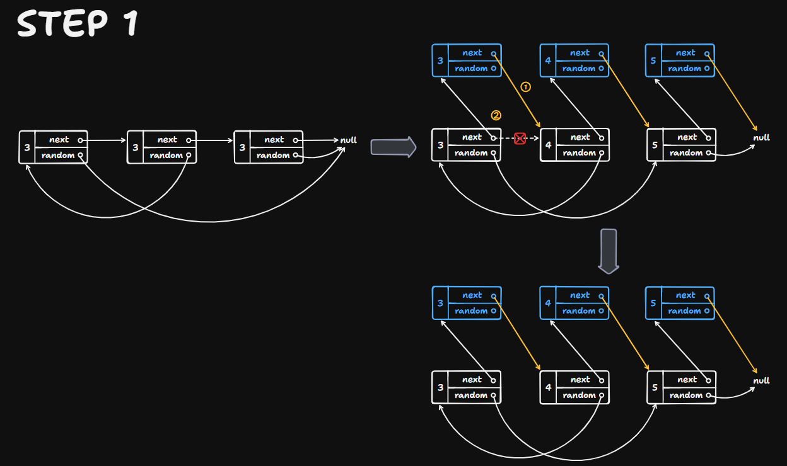
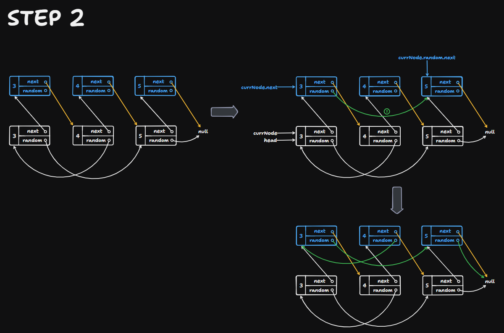
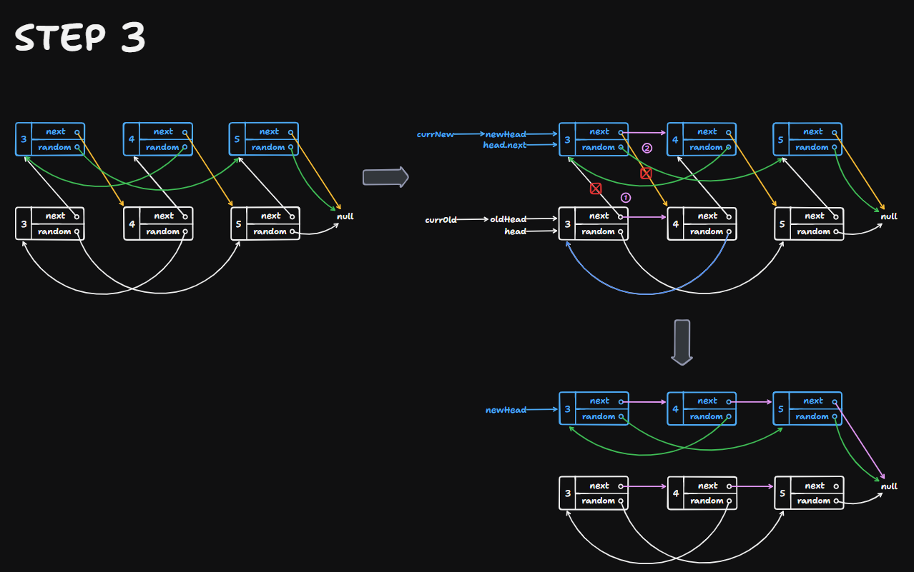

# 138 Copy List with Random Pointer

Created: September 13, 2024 4:47 PM<br>
Difficulty: Medium<br>
Topics: Hash Table, Linked List<br>
Status: Done<br>

## 📖Description

[Copy List with Random Pointer](https://leetcode.com/problems/copy-list-with-random-pointer/description/)

## 🤔Intuition

This problem requires us to construct a deep copy of the given list such that each node an additional  `random` pointer, which could point to any node in the list, or `null` . And the crux is how to keep track of the node of `random` pointer point to in the deep copy.

## 📋Approach

We can leverage a map to store the mapping between each node in the given list and its corresponding node in the deep copy list. According to this map, we’re able to efficiently search the nodes that `next` pointer and `random` pointer to when construct one node in the copied list.

### Step By Step Breakdown

- Create a hash map `copyMap` to store the mapping between each node in the given list and its corresponding node in the deep copy list.
- Initialize `currNode` to `head` for helping traverse the given list.
- Start a `while` loop util `currNode` become `null` .
    - Store the mapping between `currNode` and a corresponding new node which is constructed by `currNode.val` .
    - Update `currNode` to `currNode.next` .
- Reset `currNode` to `head` to prepare for the next traverse.
- Start another `while` loop to traverse the given list.
    - For each `currNode` , set its corresponding new node’s `next` and `random` pointers to the values of its `next` and `random` pointers in the `copyMap` respectively.

        `copyMap.get(currNode).next = copyMap.get(currNode.next) || null`

        `copyMap.get(currNode).random = copyMap.get(currNode.random) || null`

    - Update `currNode` to `currNode.next` .
- Return the deep copy of given list `copyMap.get(head)` .

## 📊Complexity

- **Time complexity:** $O(N)$
- **Space complexity:** $O(N)$

## 🧑🏻‍💻Code

```tsx
/**
 * Definition for _Node.
 * class _Node {
 *     val: number
 *     next: _Node | null
 *     random: _Node | null
 *
 *     constructor(val?: number, next?: _Node, random?: _Node) {
 *         this.val = (val===undefined ? 0 : val)
 *         this.next = (next===undefined ? null : next)
 *         this.random = (random===undefined ? null : random)
 *     }
 * }
 */

function copyRandomList(head: _Node | null): _Node | null {
    const copyMap: Map<_Node, _Node> = new Map();
    let currNode: _Node | null = head;

    while (currNode !== null) {
        copyMap.set(currNode, new _Node(currNode.val));

        currNode = currNode.next;
    }

    currNode = head;

    while (currNode !== null) {
        copyMap.get(currNode).next = copyMap.get(currNode.next) || null;
        copyMap.get(currNode).random = copyMap.get(currNode.random) || null;

        currNode = currNode.next;
    }

    return copyMap.get(head);
}
```

## 📋Optimized Approach

The above approach depends on a hash map to store the mapping relationship between the original node and its copy node. Actually, we can also let the given linked list play the role of storing this mapping relationship, so that, we don’t need to use additional memory.

### Establish The Mapping

In order to enable the original list to simulate the functionality of the hash map. We set each original node’s `next` pointer to its copy node, so that, we not only obtained the mapping between original node and its copy node, but also maintained the link from current original node to its original next node.

**Illustration**



### Setting Random Pointers

Based on the mapping relationship, we can set the copy node’s `random` pointer directly by `currNode.random.next` .

**Illustration**



### Separating Lists And Setting Next Pointers

At this point, we still need the final step, which is to separate the original list and the copy list. We use two pointers `currOld` and `currNew` to point to original list and copy list respectively, then set `currOld.next` to `currNew.next` to make it point back to its original next node, next, set `currNew.next` to `currNew.next.next` to make it point to the copy node of the `currNew.next` .

**Illustration**



### Step By Step Breakdown

- If `head` is `null` , just return `null` .
- Initialize `currNode` to `head` for helping traverse the given list.
- Start the first `while` loop to establish the mapping.
    - Create a new node `newNode` which is constructed by `currNode.val` .
    - Set `newNode.next` to `currNode.next` for helping `currNode` search its original next node.
    - Set `currNode.next` to `newNode` for establishing the mapping relationship.
    - Update `currNode` to `currNode.next` .
- Reset `currNode` to `head` to prepare for the next traverse.
- Start the second `while` loop to set `random` pointer of each copy node.
    - If `currNode.random` is not `null` , set `currNode.next.random` to `currNode.random.next` which points to its copy node. Otherwise, set `currNode.next.random` to `null` .
    - Update `currNode` to `currNode.next.next` instead of `currNode.next` due to the original next node is already become `currNode` ’s corresponding copy node’s `next` pointer.
- Initialize two pointers `currOld` and `currNew` to point to original list and copy list respectively.
- Start the final `while` loop to separate lists and set `next` pointers.
    - Set `currOld.next` to `currNew.next` to make it point back to its original next node.
    - If `currNew.next` is not `null` , set `currNew.next` to `currNew.next.next` to make it point to the copy node of the `currNew.next` . Otherwise, set `currNew.next` to `null` .
    - Simultaneously update these two pointers to point to the next node to be processed.
- Return `newHead` .

## 📊Complexity

- **Time complexity:** $O(N)$
- **Space complexity:** $O(1)$

## 🧑🏻‍💻Code

```tsx
/**
 * Definition for _Node.
 * class _Node {
 *     val: number
 *     next: _Node | null
 *     random: _Node | null
 *
 *     constructor(val?: number, next?: _Node, random?: _Node) {
 *         this.val = (val===undefined ? 0 : val)
 *         this.next = (next===undefined ? null : next)
 *         this.random = (random===undefined ? null : random)
 *     }
 * }
 */

function copyRandomList(head: _Node | null): _Node | null {
    if (head === null) {
        return null;
    }

    let currNode: _Node | null = head;

    while (currNode !== null) {
        const newNode: _Node | null = new _Node(currNode.val);

        newNode.next = currNode.next;
        currNode.next = newNode;
        currNode = newNode.next;
    }

    currNode = head;

    while (currNode !== null) {
        currNode.next.random = currNode.random ? currNode.random.next : null;
        currNode = currNode.next.next;
    }

    let oldHead: _Node | null = head;
    let newHead: _Node | null = head.next;
    let currOld: _Node | null = oldHead;
    let currNew: _Node | null = newHead;

    while (currOld !== null) {
        currOld.next = currNew.next;
        currNew.next = currOld.next ? currOld.next.next : null;
        currOld = currOld.next;
        currNew = currNew.next;
    }

    return newHead;
}
```

## 🔖Reference

1. [https://leetcode.com/problems/copy-list-with-random-pointer/solutions/4003262/97-92-hash-table-linked-list/](https://leetcode.com/problems/copy-list-with-random-pointer/solutions/4003262/97-92-hash-table-linked-list/?source=vscode)
