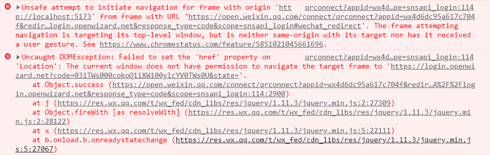
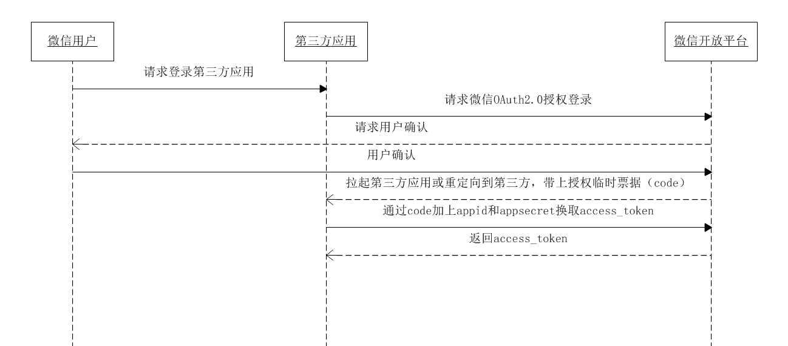

# 在electron中实现微信二维码扫码登录

## 需求分析

将微信二维码嵌入electron应用的登陆页面，用户通过扫描登录页的二维码，授权登录后跳转至应用的主界面

## 流程说明

1. 在微信开放平台注册开发者帐号，完成开发者资质认证后获得相应的AppID和AppSecret
2. 可将微信二维码登录页面的弹出绑定在应用的登录按键或直接嵌入到应用页面中（二维码URL示例：[https://open.weixin.qq.com/connect/qrconnect?appid=wxbdc5610cc59c1631&redirect_uri=https%3A%2F%2Fpassport.yhd.com%2Fwechat%2Fcallback.do&response_type=code&scope=snsapi_login&state=3d6be0a4035d839573b04816624a415e#wechat_redirect](https://open.weixin.qq.com/connect/qrconnect?appid=wxbdc5610cc59c1631&redirect_uri=https%3A%2F%2Fpassport.yhd.com%2Fwechat%2Fcallback.do&response_type=code&scope=snsapi_login&state=3d6be0a4035d839573b04816624a415e#wechat_redirect)），微信用户使用微信扫描二维码并且确认登录后，上述页面会进行重定向，重定向的目标URL会带有code和state参数（重定向URL示例：[https://test.yhd.com/wechat/callback.do?code=CODE&state=3d6be0a40sssssxxxxx6624a415e](https://test.yhd.com/wechat/callback.do?code=CODE&state=3d6be0a40sssssxxxxx6624a415e)），客户端需要将code参数发送到后端进行处理
3. 后端通过code参数加上AppID和AppSecret等，调用API（示例：https://api.weixin.qq.com/sns/oauth2/access_token?appid=APPID&secret=SECRET&code=CODE&grant_type=authorization_code）换取access_token，通过access_token进行接口调用，获取用户基本数据资源或帮助用户实现基本操作，获取access_token时序图：

    

4. 将后端服务器返回的token保存在前端数据库中
5. 通过axios创建一个request拦截器在每一个请求头中塞入token，并创建一个respone拦截器，当服务端返回特殊状态码时进行统一处理（例如：没有权限、token失效等）

## 实现细节

### 该项目通过点击登录按钮弹出微信二维码页面实现用户登录操作，代码如下：

```tsx
<iframe
/**
 * @see https://blog.csdn.net/u013557783/article/details/122427858
 * 解决浏览器同源策略拦
截微信二维码扫码跳转导致无法在主进程对重定向url进行主动拦截而登陆失败的问题
 */
   sandbox="allow-scripts allow-top-navigation"
	 src="https://open.weixin.qq.com/connect/qrconnect?appid=wx4d6dc95a617c704f&redirect_uri=https%3A%2F%2Flogin.openwizard.net&response_type=code&scope=snsapi_login#wechat_redirect"
></iframe>
```

### 想要获取code参数有以下的几种设想的方案：

- 通过window.location.href得到扫码授权后网站跳转的URL（×）
1. 直接调用window.location.href返回的是主窗口的URL而不是弹出窗口
2. 用一个Window对象childWin接收window.open()的返回值后，再通过childWin.location.href返回值为blank。可能的原因是子窗口还未完全加载完毕，但使用setTimeout()延迟调用childWin.location.href返回值仍然是blank
3. 由于浏览器的同源跳转协议，浏览器会阻止网站跨源(cross-origin)导航，因此难以获得网站跳转后的URL
- 在主进程中使用Electron的（√）[session.defaultSession.webRequest.onBeforeSendHeaders()](https://www.electronjs.org/docs/latest/api/web-request#webrequestonbeforesendheadersfilter-listener)拦截渲染进程中的页面跳转，代码如下：

```tsx
/**
 * 把微信二维码扫码授权登录后，
 * 将登陆页面重定向url中附带的code发到后端，
 * 并获取后端返回的authToken
 * @param authCode 登陆页面重定向url中附带的code
 */
export function sendLoginCode(authCode: string): void {
  // getQueryParam()于下方进行介绍
	const res = getQueryParam(authCode, 'code');
  // 将登陆页面重定向url中附带的code发到后端，这里会经过node服务器进行转发
	fetch({
		url: '/client/auth/login',
		data: {
			authCode: res,
		},
		baseURL: process.env.NODE_SERVER,
	}).then(async (response) => {
		const authToken = response.data.data.authToken;
    // saveToken()是将后端返回的authToken储存到数据库中
		const result = await authController.saveToken(authToken);
	});
}

/**
 * 从URL中提取指定参数的值
 * @param url 需要被提取的URL
 * @param param 指定参数
 * @returns 经过提取后的参数返回值 \
 * 例子：传入的url为'https://login.openwizard.net/?code=0511fC000Hy3lQ1brR300H6Os301fC02&state='，param为'code' \
 * 返回值result[0]为'?code=0511fC000Hy3lQ1brR300H6Os301fC02' \
 * 返回值result[1]为'=0511fC000Hy3lQ1brR300H6Os301fC02' \
 * 返回值result[2]为'0511fC000Hy3lQ1brR300H6Os301fC02'
 */
export function getQueryParam(url: string, param: string): string {
	const regex = new RegExp(`[?&]${param}(=([^&#]*)|&|#|$)`);
	const results = regex.exec(url) as RegExpExecArray;
	if (!results[2]) {
		return '';
	}
	return decodeURIComponent(results[2]);
}
```

<aside>
💡 使用iframe嵌入微信二维码链接，在扫码授权登录后进行重定向跨域导航时，浏览器的同源策略会在session.defaultSession.webRequest.onBeforeSendHeaders()拦截页面跳转之前进行拦截，导致无法成功拦截到我们真正想要的url。(error如下图所示)

</aside>



<aside>
💡 要解决这个问题，有两种方案：一种是在扫描二维码之前，先通过鼠标点击的方式让iframe获得一个用户手势(user gesture)，让浏览器认为是用户主动触发的跨域导航（目前存疑）；另一种是在iframe中加入sandbox="allow-scripts allow-top-navigation”属性。其中，allow-scripts ：运行执行脚本；allow-top-navigation： 允许iframe能够主导window.top进行页面跳转；

</aside>

### 关于二维码自定义样式：

可以在二维码URL中加入一个href字段，并把css样式的链接填入到此字段中，如下所示：

```tsx
src="https://open.weixin.qq.com/connect/qrconnect?appid=wx4d6dc95a617c704f&href=https://assets.openwizard.net/qrcode.css&redirect_uri=https%3A%2F%2Flogin.openwizard.net&response_type=code&scope=snsapi_login#wechat_redirect"
```

## 参考文献

1. [https://juejin.cn/post/6844903478880370701](https://juejin.cn/post/6844903478880370701)
2. [https://developers.weixin.qq.com/doc/oplatform/Website_App/WeChat_Login/Wechat_Login.html](https://developers.weixin.qq.com/doc/oplatform/Website_App/WeChat_Login/Wechat_Login.html)
3. [https://blog.csdn.net/weixin_43540589/article/details/120270588](https://blog.csdn.net/weixin_43540589/article/details/120270588)
4. [https://blog.csdn.net/qq_21440443/article/details/120196889](https://blog.csdn.net/qq_21440443/article/details/120196889)
5. [https://regexper.com](https://regexper.com/)
