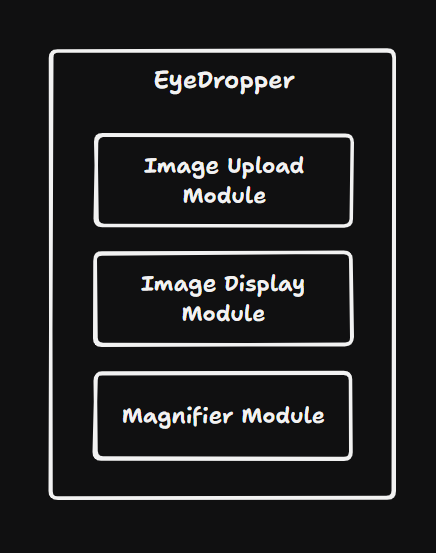
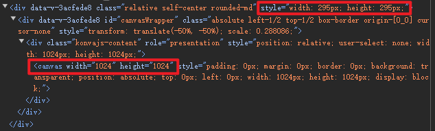
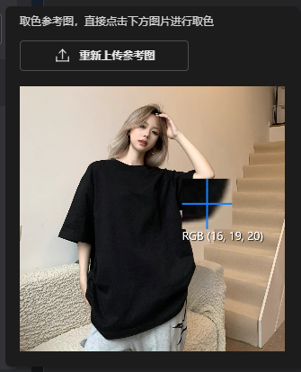
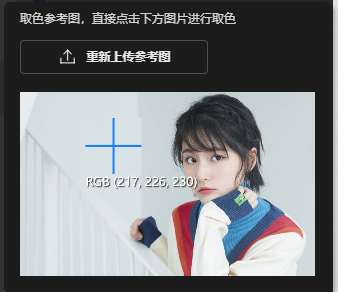
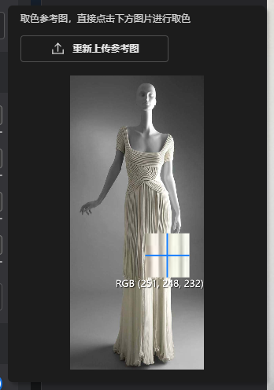
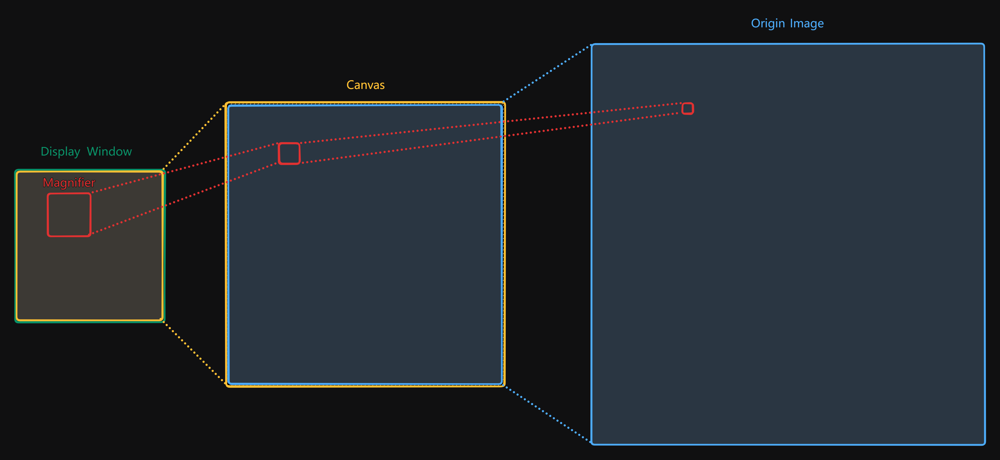
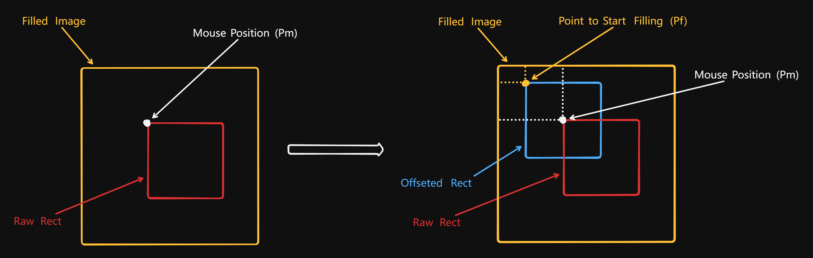
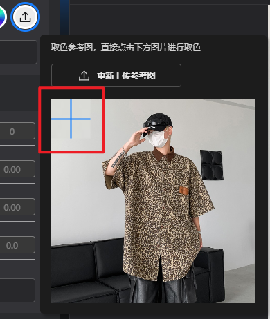

# ThinkTo__EyeDropper 模块

Created by: 俊
Tag: ThinkTo, Y2024M6
Status: Done

# 需求分析

产品需求上要求实现一个拾色器，允许用户通过选取屏幕范围内的像素颜色。Web API 中有一个 `EyeDropper` 的拾色器工具接口，但是其浏览器兼容性不高，使用场景受限较大。

因此，产品上将这个拾色器需求改为允许用户在指定区域内上传一张用于取色的参考图，以此来获取目标颜色。

# 方案设计

这个拾色器模块可以分为三个子模块——图片上传模块、图片展示模块以及放大镜模块。



- 图片上传模块

    封装一个 Antd Vue 的 upload 组件。

- 图片展示模块

    图片展示区域通过 Konva 实现。用户上传图片后，将图片绘制在 Konva 的舞台中。

- 放大镜模块

    由于用于取色的参考图是绘制在 Konva 的舞台中，因此放大镜也可以利用 `Konva.Shape` 进行组装并同样绘制在此舞台中。


# 实现细节

## 图片展示模块 —— 缩放

```html
<div class="flex max-h-[479px] w-[327px] flex-col items-start rounded-md bg-[#1c1c1c] p-[10px_16px_16px_16px] shadow-[4px_4px_4px_0_rgba(0,0,0,0.25)]">
		<div ref="imageWindowRef" class="relative self-center rounded-md">
		    <div
		        id="canvasWrapper"
		        ref="canvasWrapperRef"
		        class="absolute left-1/2 top-1/2 box-border origin-[0_0] cursor-none"
		        :style="{ transform: `translate(-50%,-50%)` }"
		    ></div>
		</div>
</div>
```

由于用户上传的图片尺寸大小是无法预测的，因此需要设计一套缩放规则来统一图片展示的样式。特别要注意的是，这里的缩放需要考虑到两个坐标系 —— Konva 舞台容器坐标系和用于承载 Konva 舞台的 div 元素坐标系。两个坐标系在 HTML 中的展示如下：



### 缩放规则

- Konva 舞台容器坐标系：上传图片原图尺寸不得超过 `MAX_CANVAS_AREA`
- 用于承载 Konva 舞台的 div 元素坐标系：
    1. 若上传的图片宽高分别小于 `MAX_ELEMENT_WIDTH` 和 `MAX_ELEMENT_HEIGHT` 则不做缩放；
    2. 若上传的图片宽高存在大于最大值的情况，则按照最长边进行缩放

代码如下：

```tsx
const MAX_CANVAS_AREA = 1048576; // 1024 * 1024;
const MAX_ELEMENT_WIDTH = 295;
const MAX_ELEMENT_HEIGHT = 374;
const ELEMENT_ASPECT_RATIO = MAX_ELEMENT_WIDTH / MAX_ELEMENT_HEIGHT;

export interface ICanvasScaleInfo {
    /**
     * 缩放后的 konva 容器的 width
     */
    canvasScaledW: number;
    /**
     * 缩放后的 konva 容器的 height
     */
    canvasScaledH: number;
}

export interface IElementScaleInfo {
    /**
     * 用于承载 konva 容器的 div 元素的缩放比例
     */
    elementScaledRatio: number;
    /**
     * 缩放后用于承载 konva 容器的 div 元素的 width
     */
    elementScaledW: number;
    /**
     * 缩放后用于承载 konva 容器的 div 元素的 height
     */
    elementScaledH: number;
}

export interface IScaleInfo {
    /**
     * konva 容器的缩放信息
     */
    canvasScaledInfo: ICanvasScaleInfo;
    /**
     * 用于承载 konva 容器的 div 元素的缩放信息
     */
    elementScaleInfo: IElementScaleInfo;
}

/**
 * 计算缩放参数。此处需要计算的缩放参数有两个：
 * 1. 上传图片原图尺寸与 MAX_CANVAS_AREA 之间的缩放参数；
 * 2. konva 容器的尺寸与承载 konva 容器的 div 元素尺寸之间的缩放参数；
 * @param rawWidth 用于取色所上传的图片的 Width
 * @param rawHeight 用于取色所上传的图片的 Height
 * @returns 放大镜模块所需的所有缩放参数。包括缩放后的 konva 容器的宽高、缩放后用于承载 konva 容器的 div 元素的宽高及其缩放比例
 */
export function scaleInitializer(rawWidth: number, rawHeight: number): IScaleInfo {
    // 计算上传图片原图尺寸与 MAX_CANVAS_AREA 之间的缩放参数
    // 缩放规则：上传图片原图尺寸不得超过 MAX_CANVAS_AREA
    const area = rawWidth * rawHeight;
    const canvasScaleRatio = area > MAX_CANVAS_AREA ? Math.sqrt(MAX_CANVAS_AREA / area) : 1;
    const canvasScaledW = Math.round(rawWidth * canvasScaleRatio);
    const canvasScaledH = Math.round(rawHeight * canvasScaleRatio);

    // 计算 konva 容器尺寸与承载 konva 容器的 div 元素尺寸之间的缩放参数
    // 缩放规则：
    // 1. 若上传的图片宽高分别小于 MAX_ELEMENT_WIDTH 和 MAX_ELEMENT_HEIGHT
    //    则不做缩放
    // 2. 若上传的图片宽高存在大于最大值的情况，则按照最长边进行缩放
    const imageAspectRatio = canvasScaledW / canvasScaledH;
    const elementScaledRatio =
        canvasScaledW <= MAX_ELEMENT_WIDTH && canvasScaledH <= MAX_ELEMENT_HEIGHT
            ? 1
            : imageAspectRatio > ELEMENT_ASPECT_RATIO
              ? MAX_ELEMENT_WIDTH / canvasScaledW
              : MAX_ELEMENT_HEIGHT / canvasScaledH;
    const elementScaledW = Math.round(canvasScaledW * elementScaledRatio);
    const elementScaledH = Math.round(canvasScaledH * elementScaledRatio);

    const canvasScaledInfo: ICanvasScaleInfo = {
        canvasScaledW,
        canvasScaledH,
    };
    const elementScaleInfo: IElementScaleInfo = {
        elementScaledRatio,
        elementScaledW,
        elementScaledH,
    };
    const scaleInfo: IScaleInfo = {
        canvasScaledInfo,
        elementScaleInfo,
    };

    return scaleInfo;
}
```

### 缩放结果展示

长宽比等于 1



长宽比大于 1



长宽比小于 1



## 放大镜模块 —— 放大原理

利用 Konva 实现放大镜效果有两种方案。一种是以预设的放大镜尺寸展示放大镜组件，然后将经过预设放大倍率放大后的图片填充至放大镜内；另一种是先以预设放大倍率相同的数值缩小放大镜组件，并在此尺度上填充展示图片窗口大小的图片，然后再一同以预设的放大倍率进行放大将放大镜复原至预设尺寸。

两种方案在效果和性能上差异并不大，这里采用的是第二种实现方案。

### 实施细节

具体实施上需要经过两次缩放，一次是从 Origin Image 到 Canvas 的缩放。另一次是 Canvas 到 Display Window 的缩放（关于缩放相关的内容在上一节已详细谈及）。因此，放大镜的尺寸也需要经过两次缩小。

为了方便理解，可以将这两次缩放过程用下图来表示：



填充到放大镜内的图片同样也需要经过两次缩放操作，但两次缩放的操作有区别。第一次缩放操作为将用户上传的原图尺寸缩放为与 `Canvas` 尺寸一致后填充到放大镜中；第二次缩放操作为利用  `Konva.Rect` 的 `fillPatternScale` 属性来规定以从 `Canvas` 到 `Display Window` 的缩放比例进行填充。

第一次缩放操作的函数实现如下：

```tsx
/**
 * 将 HTMLImageElement 缩放至指定的 width 和 height
 * @param image 待缩放的 HTMLImageElement
 * @param width 缩放目标 width
 * @param height 缩放目标 height
 * @returns 缩放后的 HTMLImageElement 及其 ImageData
 */
function scaledImage(
    image: HTMLImageElement,
    width: number,
    height: number
): { scaledImageEL: HTMLImageElement; scaledImageData: ImageData } {
    const canvas = document.createElement('canvas');
    canvas.width = width;
    canvas.height = height;
    const ctx = canvas.getContext('2d')!;
    ctx.drawImage(image, 0, 0, width, height);
    const scaledImageData = ctx.getImageData(0, 0, width, height);

    const scaledImageEL = new Image();
    scaledImageEL.src = canvas.toDataURL();

    return { scaledImageEL, scaledImageData };
}
```

因此，再将放大镜重新放大的操作则为上述两次缩小的逆向操作。

## 放大镜模块 —— 组成

### 放大镜的主体

放大镜的主体使用的是 `Konva.Rect`，这里比较难理解的是 `fillPatternOffset` 这个属性及其初始化的参数。代码如下：

```tsx
const { centerX: defaultCenterX, centerY: defaultCenterY } = DEFAULT_MAGNIFIER_CENTER;
const canvasPosOffsetX = mapElementToCanvas(defaultCenterX, elementScaleRatio);
const canvasPosOffsetY = mapElementToCanvas(defaultCenterY, elementScaleRatio);

const { centerX: canvasCenterX, centerY: canvasCenterY } = CANVAS_MAGNIFIER_CENTER;
const canvasFillPatternOffsetX = mapElementToCanvas(canvasCenterX, elementScaleRatio);
const canvasFillPatternOffsetY = mapElementToCanvas(canvasCenterY, elementScaleRatio);

// 放大镜的主体
const magnifier = new Konva.Rect({
  id: 'magnifier',
  x: 0,
  y: 0,
  width: CANVAS_MAGNIFIER_SIZE,
  height: CANVAS_MAGNIFIER_SIZE,
  fillPatternImage: scaledImageEL, // 缩放为 konva 容器大小的 HTMLImageElement
  fillPatternScale: {
    x: elementScaleRatio, // 用于承载 konva 容器的 div 元素的缩放比例
    y: elementScaleRatio,
  },
  fillPatternOffset: {
    x: canvasPosOffsetX - canvasFillPatternOffsetX,
    y: canvasPosOffsetY - canvasFillPatternOffsetY,
  }, // 此处是为了放大镜处于初始位置时也能正确填充放大后的图片
});
```

`fillPatternOffset` 这个属性指的是图片在 `Konva.Rect`中填充的偏移量，即从用于填充的图片的哪里开始作为填充的起始点。我们基于下图进行解释：



`Konva.Rect` 的 `position` 是以左上角坐标为基准点，为了使得 `Konva.Rect` 的中心跟随鼠标指针，先对 `Konva.Rect` 的定位进行偏移（图中红色矩形到蓝色矩形的过程）。偏移后需要更新填充图片的偏移量，即更新 $Pf$ 点的坐标：

$$
P_fx=P_mx-Ox
$$

$$
P_fy=P_my-O_y
$$

 $P_m$ 为鼠标指针的坐标；$O$ 为 `Konva.Rect` 定位的偏移量，这里为放大镜在 `Canvas` 上未经过放大后的尺度下的 `Konva.Rect` 中心点的 $x,y$，此为固定值，由上传的图片尺寸唯一确定。

回到放大镜主体的初始化代码来分析 `fillPatternOffset` 这个属性的初始化参数的含义。

```tsx
fillPatternOffset: {
    x: canvasPosOffsetX - canvasFillPatternOffsetX,
    y: canvasPosOffsetY - canvasFillPatternOffsetY,
  } // 此处是为了放大镜处于初始位置时也能正确填充放大后的图片
```

这是因为我们希望放大镜初始化在图片的右上角。



此时放大镜中心的坐标（放大镜在 `Canvas` 上经过放大后的尺度）即为 $P_m$ 鼠标指针的坐标。`canvasFillPatternOffsetX` 为 `Konva.Rect` 定位的偏移量（放大镜在 `Canvas` 上未经过放大后的尺度）。

### 放大镜的其余部分

放大镜的其余部分的具体实现不在此处一一列出。需要注意的是，组成放大镜的其余部分在与尺寸相关的属性上都要遵循先缩小后放大的原则。

# 参考文章

[EyeDropper - Web API | MDN](https://developer.mozilla.org/zh-CN/docs/Web/API/EyeDropper)

[Ant Design Vue — An enterprise-class UI components based on Ant Design and Vue.js](https://antdv.com/components/upload-cn)

[文档](http://konvajs-doc.bluehymn.com/docs/index.html)
